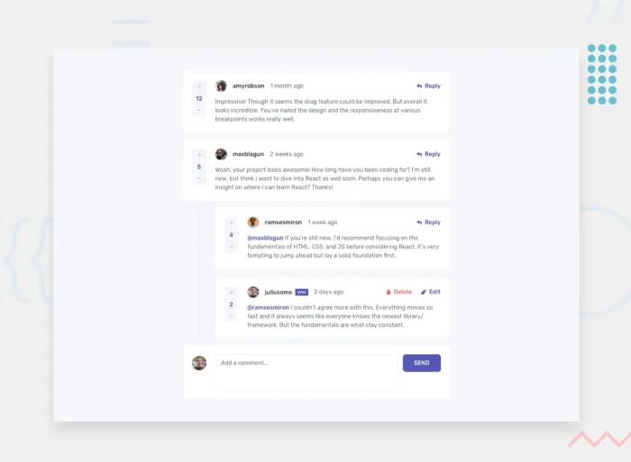
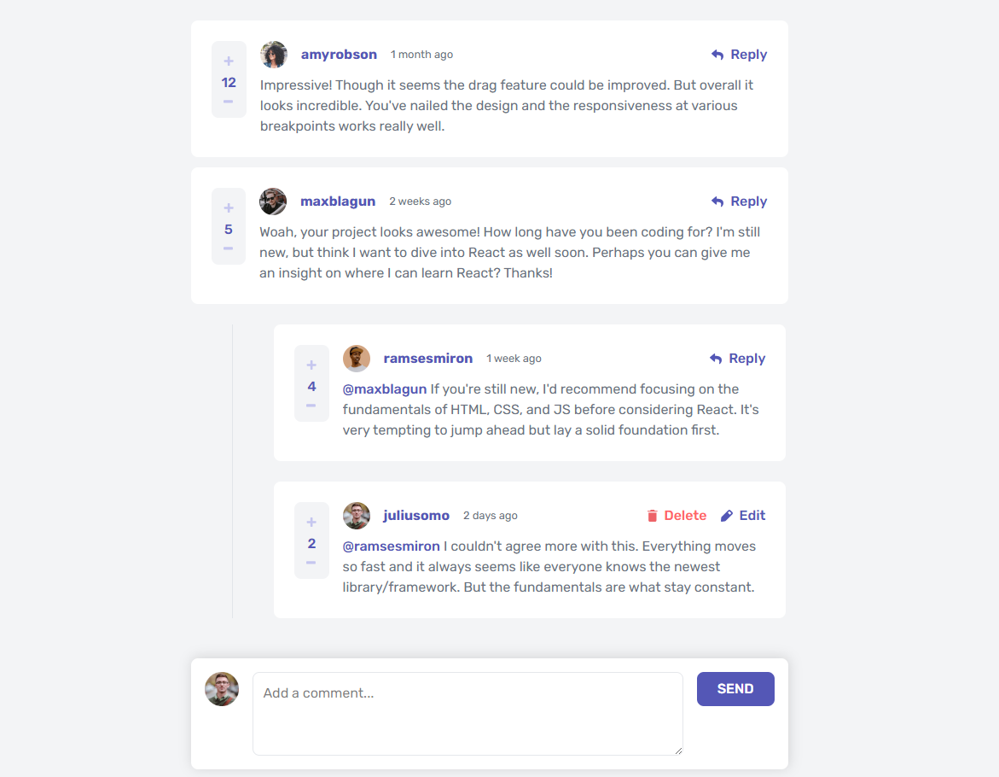

# Frontend Mentor - Interactive comments section solution

This is a solution to the [Interactive comments section challenge on Frontend Mentor](https://www.frontendmentor.io/challenges/interactive-comments-section-iG1RugEG9). Frontend Mentor challenges help you improve your coding skills by building realistic projects. 

## Table of contents

- [Overview](#overview)
  - [The challenge](#the-challenge)
  - [Screenshot](#screenshot)
  - [Links](#links)
- [My process](#my-process)
  - [Built with](#built-with)
- [Author](#author)

### The challenge

Users should be able to:

- View the optimal layout for the app depending on their device's screen size
- See hover states for all interactive elements on the page
- Create, Read, Update, and Delete comments and replies
- Upvote and downvote comments
- **Bonus**: If you're building a purely front-end project, use `localStorage` to save the current state in the browser that persists when the browser is refreshed.
- **Bonus**: Instead of using the `createdAt` strings from the `data.json` file, try using timestamps and dynamically track the time since the comment or reply was posted.

### Screenshot

### Links

- Solution URL: [Interactive-comments-section](https://github.com/Gerson77/Interactive-comments-section)
- Live Site URL: [Interactive-comments-section Live](https://your-live-site-url.com)

### Built with

- [React](https://reactjs.org/) - JS library
- [TailwindCSS v4.1](https://tailwindcss.com/) - For styles

## Author

- Website - [portifolio](https://www.your-site.com)
- Frontend Mentor - [@Gerson77](https://www.frontendmentor.io/profile/Gerson77)
- Linkedin - [@yourusername](https://linkedin/in/gerson-santos-silva)

